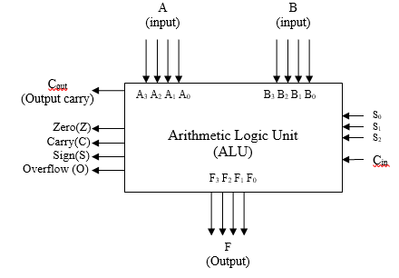

# alu-simulation

 Verilog code for an ALU that has been simulated and tested in Vivado. This was the final project for the CS 151 course at UC Irvine in Fall 2018. All of the test benches are in [alu-simulation/sim_1](alu-simulation/sim_1) and all of the components are in
[alu-simulation/sources_1](alu-simulation/sources_1). 

### The ALU can perform the following operations:

- add
- subtract
- and
- not
- or
- xor
- shift
- sign_extender
- mux
- read
- write
